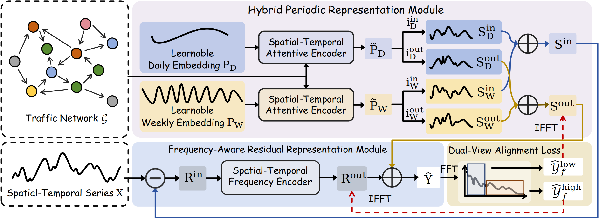
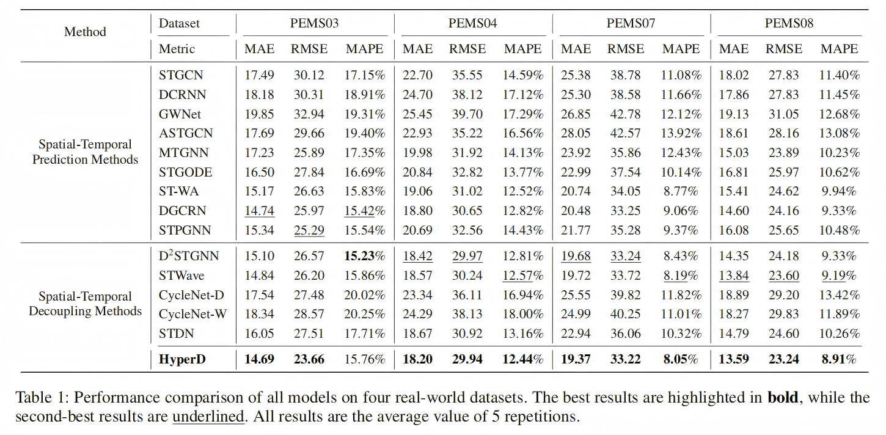

# HyperD
A pytorch implementation for the paper: "HyperD: Hybrid Periodicity Decoupling Framework for Traffic Forecasting".



## Getting Started

### Environment Requirements

The code is built based on Python 3.12.7, PyTorch 2.5.1, and [EasyTorch](https://github.com/cnstark/easytorch).

We implement our code based on [BasicTS](https://github.com/zezhishao/BasicTS/tree/master).

Dependency can be installed using the following command:

```bash
pip install -r requirements.txt
```

### Download Data
You can download data from [BasicTS](https://github.com/GestaltCogTeam/BasicTS/blob/master/tutorial/dataset_design.md) and unzip it
into the `datasets` directory.

We use four datasets: `PEMS03`, `PEMS04`, `PEMS07`, and `PEMS08`.  
Each dataset directory should contain the following three files:
- `data.dat`: time series data
- `adj_mx.pkl`: adjacency matrix
- `desc.json`: dataset description and metadata

### Statistical Prior Initialization
Run `Initialization.py` to generate the initialization matrices for learnable daily and weekly embeddings. The results 
will be automatically saved in the `datasets/{dataset_name}` directory.

For example:
```bash
python Initialization.py -d PEMS08
```

Two `.npy` files will be generated:
- `daily_init.npy`
- `weekly_init.npy`

These files will be automatically loaded during model training.

## Run
To train the model, run:

```bash
python train.py --cfg='baselines/HyperD/PEMS03.py'
python train.py --cfg='baselines/HyperD/PEMS04.py'
python train.py --cfg='baselines/HyperD/PEMS07.py'
python train.py --cfg='baselines/HyperD/PEMS08.py'
```

## Main Results
